# Order Return Agent - Data Flow Architecture v1.0

## Table of Contents
1. [System Architecture Overview](#system-architecture-overview)
2. [Application Initialization](#application-initialization)
3. [Message Processing Pipeline](#message-processing-pipeline)
4. [Tool Execution Flows](#tool-execution-flows)
5. [Database State Transitions](#database-state-transitions)
6. [Complete Conversation Example](#complete-conversation-example)
7. [Error Handling Paths](#error-handling-paths)
8. [Payload Specifications](#payload-specifications)

---

System Architecture Overview - Layered architecture with Client, Agent, Tools, RAG, and Data layers
Application Initialization - Startup sequence with conditional database setup
Core Agent Loop - Complete message processing pipeline with error handling
Agent Decision Flow - How LLM chooses and chains tools together
6 Tool Execution Flows - Detailed flowcharts for each tool:
GetOrderDetails (lookup paths)
CheckEligibility (9-step decision tree)
CreateRMA (RMA generation)
GenerateReturnLabel (label generation)
SendEmail (template rendering)
EscalateToHuman (ticket creation)
Database State Transitions - State diagrams for:
Order lifecycle
RMA lifecycle
Escalation state machine
Conversation Examples - Two complete flows showing:
Turn 1: Successful return with all tools
Turn 3: Escalation scenario with damage detection
Error Handling - Exception categorization and recovery flows
Payload Schemas - Input/output transformations for all tools
All diagrams are now interactive Mermaid flowcharts that render cleanly in markdown viewers. The visual flow is much clearer than ASCII, and they'll render automatically in GitHub, GitLab, and most markdown processors.

---

## System Architecture Overview

The system follows a layered architecture with clear separation of concerns:

- **Client Layer**: CLI interface where users interact with the agent via text input
- **Agent Layer**: LangChain-based orchestrator that coordinates tool execution and LLM reasoning
- **Tool & Service Layer**: 6 specialized tools for business operations, RAG system for context retrieval, and Ollama LLM for reasoning
- **Data Layer**: SQLite database for persistence and markdown knowledge base for policies/procedures

Data flows bidirectionally through all layers. The agent acts as the central hub, routing user requests to appropriate tools and synthesizing responses from tool outputs and RAG context.

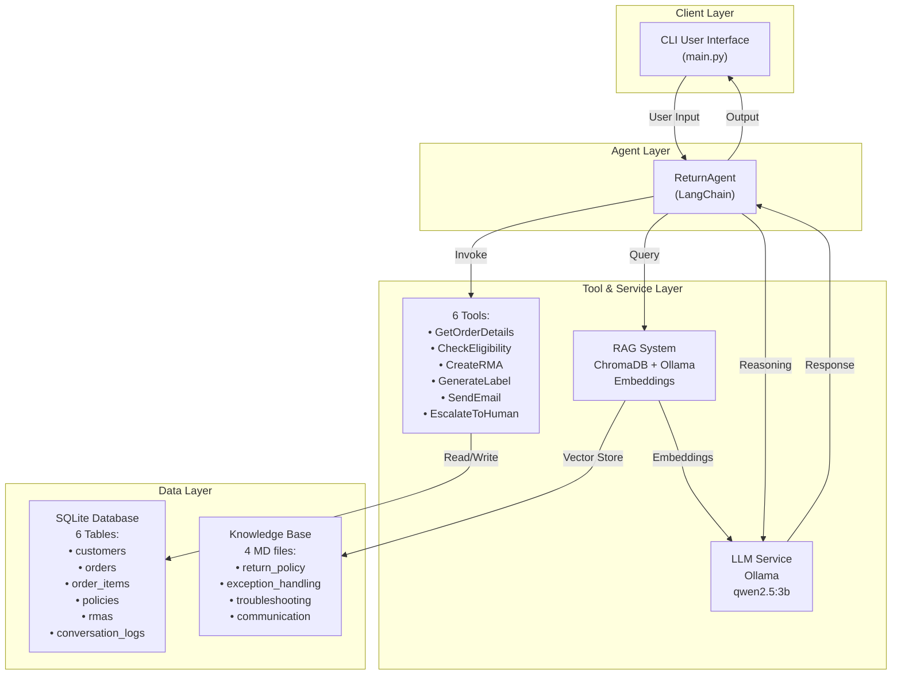

---

## Application Initialization

### Startup Sequence

When the application starts, it performs the following initialization steps:

1. **Logging Setup**: Configures console (INFO level) and file (DEBUG level with 500MB rotation) logging
2. **Welcome Display**: Shows user instructions and available commands
3. **Database Initialization**: Creates SQLite tables if this is a fresh installation, or loads existing database
4. **Data Seeding** (first run only): Populates database with test data including 20 customers, 50+ orders, 5 return policies, and 3 example RMAs for testing
5. **Session Creation**: Generates unique session UUID to track conversation across multiple turns
6. **LLM Initialization**: Loads ChatOllama model (qwen2.5:3b) with temperature=0 for deterministic responses
7. **Tool Registration**: Registers all 6 tools with type-safe argument schemas
8. **RAG Initialization**: Loads ChromaDB vector store and verifies it's healthy; ingests knowledge base documents if needed (4 markdown files: return_policy, exception_handling, troubleshooting, communication)
9. **Agent Creation**: Instantiates LangChain agent executor with tools, LLM, and system prompt
10. **Main Loop**: Enters conversation loop awaiting user input

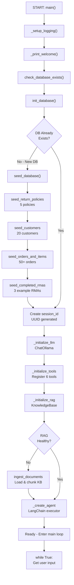

---

## Message Processing Pipeline

### Core Agent Loop

The agent processes each user message through a standardized pipeline:

1. **User Message Logging**: Every user input is immediately logged to `conversation_logs` table for audit trail
2. **Agent Invocation**: User message wrapped in `HumanMessage` and passed to LangChain agent executor
3. **LLM Reasoning**: LLM analyzes the request and decides which tool(s) to call (or generate final response)
4. **Tool Execution**: If tools are needed, they execute sequentially with results passed back to LLM context
5. **Loop Iterations**: Up to 15 iterations allowed; after each tool result, LLM decides: call another tool or generate response?
6. **Response Generation**: Once no more tools needed or max iterations reached, LLM generates final response
7. **Response Extraction**: Parse response from agent executor result
8. **Response Formatting**: Clean up response (remove XML tags, trim whitespace)
9. **Response Logging**: Log agent response to `conversation_logs` for audit trail
10. **Error Handling**: If exception occurs at any step, categorize error type and return user-friendly message
11. **Display**: Response printed to user and returned to main loop for next input

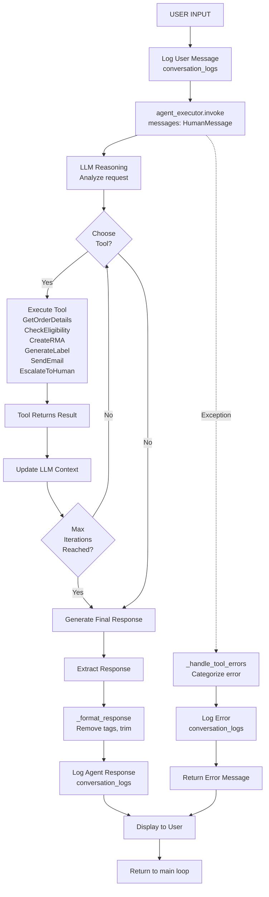

### Agent Decision Flow

The LLM uses intelligent reasoning to determine which tools to call based on the user request:

- **Intent Analysis**: LLM reads the user's request and understands what they're asking for
- **Tool Selection**: Based on intent, LLM decides which tools to invoke (e.g., GetOrderDetails → CheckEligibility → CreateRMA)
- **Sequential Execution**: Tools are called one at a time, with each result informing the next decision
- **Context Accumulation**: Each tool result is added to the LLM's context, building a complete picture of the situation
- **Loop Control**: After each tool executes, LLM evaluates: "Do I need another tool?" If yes, loop back; if no, generate response
- **Error Handling**: If a tool returns an error or unexpected result, LLM may retry, escalate, or try an alternative approach
- **Response Synthesis**: Once all tools are done, LLM synthesizes a coherent response that incorporates all tool outputs and contextual information

This design allows complex multi-step workflows (order lookup → eligibility check → RMA creation → label generation → email notification) to be handled automatically while keeping the LLM focused on reasoning rather than low-level operations.

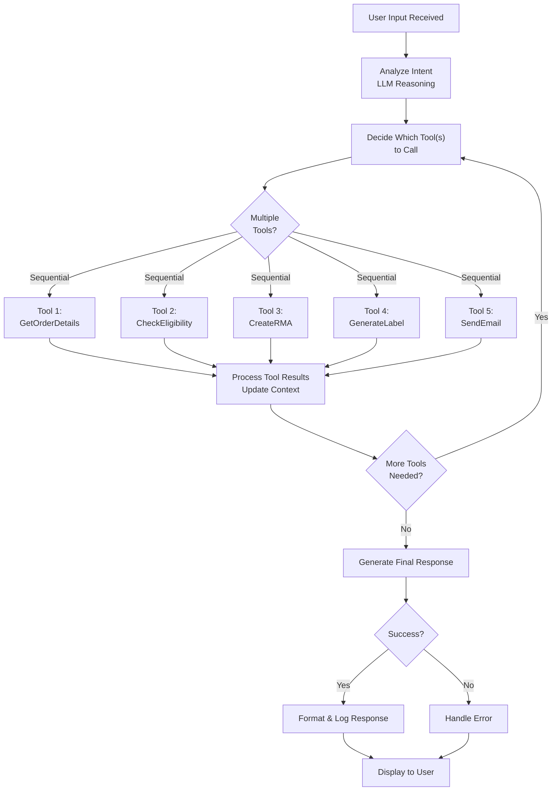

---

## Tool Execution Flows

Tools are the core execution units where business logic happens. Each tool is type-safe (uses Pydantic schemas), idempotent, and handles its own errors gracefully. Tools interact with the database, external systems, or perform calculations, but never make eligibility decisions themselves.

### 1. GetOrderDetails Tool

**Purpose**: Retrieve order information from the database by order ID or customer email.

**Input**: Either order_id (exact match) or email (returns up to 10 most recent orders)

**Output**: OrderSchema containing order details, items list, and customer information

**Key Features**:
- Dual lookup methods: by order number or customer email
- Eager loads related data (items, customer) in single query
- Validates input: requires either ID or email (XOR constraint)
- Returns list for email lookups (customer may have multiple orders) vs single order for ID lookups
- No business logic decisions; purely data retrieval

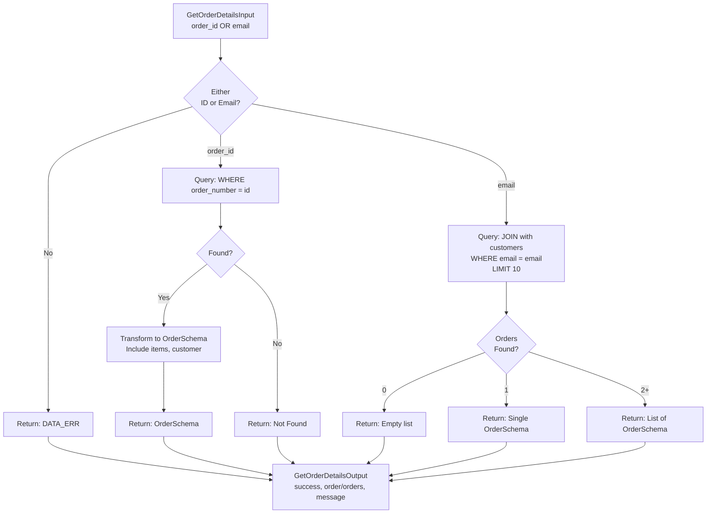

### 2. CheckEligibility Tool (Critical Business Logic)

**Purpose**: Apply deterministic return policy rules to determine if a return is eligible. This is the most critical tool as it prevents LLM from making arbitrary business decisions.

**Input**: order_id, item_ids (which items to return), return_reason (customer's stated reason)

**Output**: CheckEligibilityOutput with reason_code (APPROVED, TIME_EXP, ITEM_EXCL, DATA_ERR, RISK_MANUAL, DAMAGED_MANUAL)

**Key Features**:
- **9-step decision tree**: All rules are deterministic and coded, NOT interpreted by LLM
- **Damage Detection**: Keywords (damaged, defective, broken, shattered, torn) trigger DAMAGED_MANUAL escalation
- **Fraud Prevention**: fraud_flag or high return frequency (≥3 in 30 days) trigger RISK_MANUAL escalation
- **Item Validation**: Checks is_returnable and is_final_sale flags per item
- **Policy Matching**: Prioritizes VIP (120 days) > Category-specific > General (30 days)
- **Window Enforcement**: Rejects returns outside policy window (TIME_EXP)
- **Safe Escalation**: Any uncertainty triggers manual review rather than automatic approval

This tool ensures consistent, auditable decisions that comply with company policy. The LLM cannot override eligibility decisions; it can only request escalation to humans.

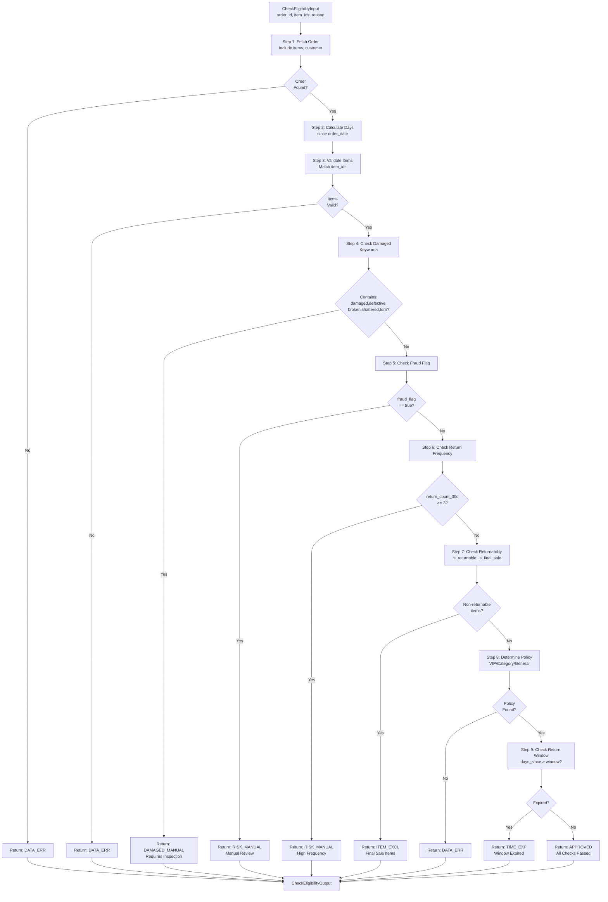

### 3. CreateRMA Tool

**Purpose**: Create a Return Merchandise Authorization (RMA) record and initiate the return process.

**Input**: order_id, customer_id, item_ids (which items), return_reason, reason_code (from CheckEligibility)

**Output**: CreateRMAOutput with RMA number (e.g., "RMA-1701234567-ABCD") and refund amount

**Key Features**:
- **Unique RMA Generation**: Format "RMA-{timestamp}-{4 random chars}" ensures global uniqueness
- **Refund Calculation**: Sums item prices × quantities for partial returns
- **State Transition**: Updates order status from "Delivered" to "Return_Initiated"
- **Database Persistence**: Creates RMA record with status="Initiated" (waiting for label generation)
- **Deterministic**: No policy logic; simply records the return transaction

**Database Changes**:
- Creates 1 new rmas table row
- Updates 1 orders table row with new status

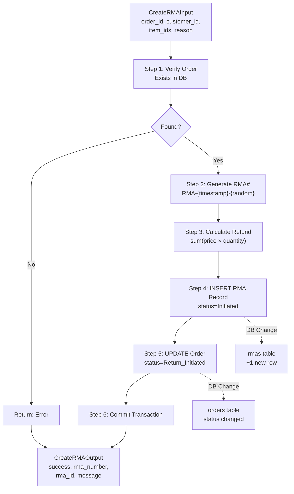

### 4. GenerateReturnLabel Tool

**Purpose**: Generate a prepaid return shipping label and tracking number for the customer.

**Input**: order_id, rma_number (from CreateRMA)

**Output**: GenerateReturnLabelOutput with label_url and tracking_number

**Key Features**:
- **Carrier Selection**: Randomly selects from USPS, UPS, FEDEX (in production, would integrate with actual carrier APIs)
- **Tracking Number Format**: "{CARRIER}-{12 random digits}" (e.g., "FEDEX-123456789012")
- **Label URL**: Static format simulating CDN URL (e.g., "https://returns.example.com/labels/RMA-1701234567-ABCD.pdf")
- **State Update**: Transitions RMA status from "Initiated" to "Label_Sent"
- **Simulated**: Currently mocked; in production would call actual logistics APIs (EasyPost, ShipStation, etc.)

**Database Changes**:
- Updates 1 rmas table row with tracking_number, label_url, and new status

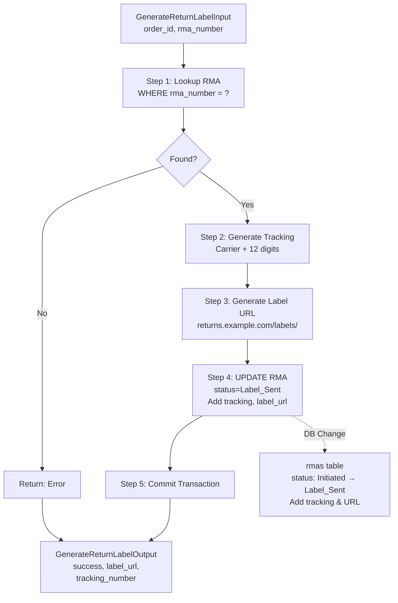

### 5. SendEmail Tool

**Purpose**: Send templated email notifications to customers at key milestones in the return process.

**Input**: customer_email, template_name (return_approved, return_rejected, label_ready), context dict with template variables

**Output**: SendEmailOutput with message_id, preview (first 200 chars), and success status

**Key Features**:
- **Template Library**: 3 templates for different scenarios (approved, rejected, label ready)
- **Jinja2 Rendering**: Context variables interpolated into templates (customer_name, order_number, rma_number, refund_amount, label_url, etc.)
- **Message ID Generation**: Unique ID format "MSG-{timestamp}-{hash}" for tracking
- **Email Logging**: Logs to console and optionally to database via conversation_logs
- **Simulated**: Currently mocked (logs to console/file); in production would integrate with AWS SES, SendGrid, Mailgun, etc.
- **Audit Trail**: Optional database logging preserves email metadata for compliance

**Database Changes** (optional):
- Inserts 1 conversation_logs row with message_type="system" and email metadata

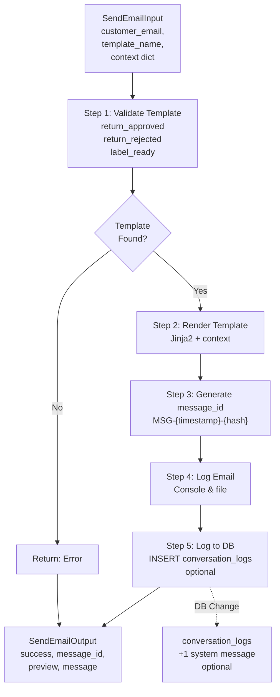

### 6. EscalateToHuman Tool

**Purpose**: Create escalation tickets when cases require human specialist review and decision-making.

**Input**: session_id (conversation identifier), reason (why escalating), priority (LOW/MEDIUM/HIGH/URGENT)

**Output**: EscalateToHumanOutput with ticket_id and comprehensive handoff summary

**Key Features**:
- **Ticket Generation**: Unique ID format "TICKET-{timestamp}-{hash}" for tracking
- **Conversation Retrieval**: Fetches all conversation_logs for the session to provide context
- **Summary Building**: Generates structured handoff summary including:
  - Escalation reason
  - Conversation length and key messages
  - Customer request details
  - Actions already taken
  - Recommended next steps
- **RMA Marking**: Updates related RMA records with escalated=true flag
- **Priority Support**: Allows setting priority (URGENT cases handled faster)
- **Complete Handoff**: Specialist has full context to make informed decision without asking customer to repeat

**Common Escalation Triggers**:
- Damaged/defective items (requires inspection)
- Fraud flags or high return frequency
- Policy exceptions (beyond return window but customer has good reason)
- Data errors or system issues
- Complex cases requiring manager approval

**Database Changes**:
- Updates 0-N rmas table rows with escalated=true and escalation_reason
- Inserts 1 conversation_logs row with message_type="system" and ticket details

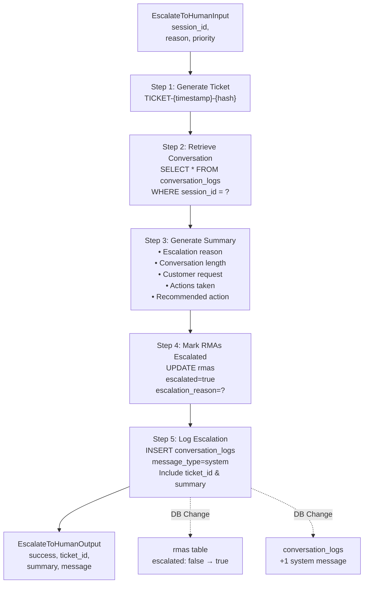

---

## Database State Transitions

The system maintains strict state machines for orders and RMAs to track progress through the return workflow. All state changes are logged to conversation_logs for audit compliance.

### Order Lifecycle

Orders flow through a lifecycle reflecting their shipping and return status:

- **Pending**: Order created but not yet shipped
- **Shipped**: Order dispatched to customer
- **Delivered**: Order reached customer (typical starting point for returns)
- **Return_Initiated**: CreateRMA called; customer approved for return
- **Returned**: Return received and fully processed
- **[End]**: No further return action taken (order archived)

Once an order transitions to "Return_Initiated", an associated RMA record manages the remainder of the return process.

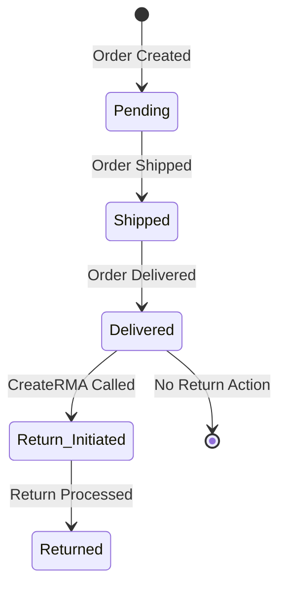

### RMA Lifecycle

RMAs (Return Merchandise Authorizations) represent the actual return transaction and flow through multiple states:

- **Initiated**: RMA created via CreateRMA tool; waiting for label generation
- **Label_Sent**: GenerateReturnLabel called; customer has prepaid shipping label
- **In_Transit**: Customer shipped the item back
- **Received**: Item arrived at warehouse and is waiting for inspection
- **Inspected**: QA team has examined the returned item
- **Approved**: Item passed quality check; eligible for refund/exchange
- **Refunded**: Customer refund processed
- **Rejected**: Item failed QA (e.g., damage, wrong item)
- **Processed**: Customer notified of rejection decision
- **[Escalated]**: At any point, case can be marked as escalated=true if requires specialist review

The RMA record holds critical financial information (refund_amount) and audit trail (escalated, escalation_reason).

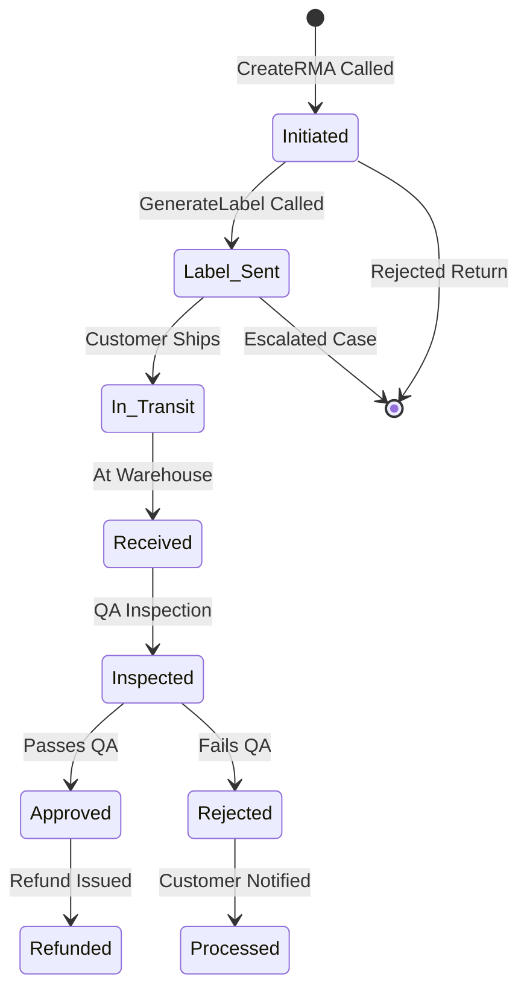

### Escalation State

The escalation state is orthogonal to the main RMA lifecycle; an RMA can be escalated at any point:

- **Not Escalated** (escalated=false): Standard automated processing; LLM and tools can make decisions
- **Escalated** (escalated=true): Requires human specialist review; RMA record locked from automated state changes
- **Specialist Review Phase**: Specialist pulls up conversation history and RMA details via ticket_id
- **Resolution Phase**: Specialist makes final decision (approve exception, request more info, reject)
- **Post-Resolution**: RMA transitions back to normal workflow with specialist's decision recorded

Escalation reasons stored in escalation_reason field for compliance and root-cause analysis.

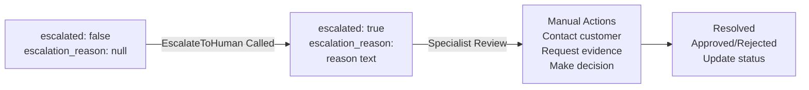

---

## Complete Conversation Example

This section walks through two realistic conversations showing how the system handles different scenarios in real-time.

### Turn 1: Successful Return

**Scenario**: Customer has a valid return request for an order within the return window with no complications.

**User**: "I want to return my hiking boots from order 77893. They're too small."

**Execution**:
1. LLM analyzes: "Customer wants to return an order, needs lookup"
2. GetOrderDetails: Find order #77893 → Found (Hiking Boots, $129.99, delivered 15 days ago)
3. LLM analyzes: "Need to check if return is eligible"
4. CheckEligibility: Evaluate order → APPROVED (15 days < 30-day policy, no risk flags)
5. LLM analyzes: "Return approved, create RMA"
6. CreateRMA: Generate RMA #RMA-1701234567-ABCD, refund $129.99
7. LLM analyzes: "Generate label for shipping"
8. GenerateReturnLabel: Create tracking #FEDEX-123456789012, label URL
9. LLM analyzes: "Send confirmation to customer"
10. SendEmail: Send return_approved template with all details
11. LLM synthesis: Combine all results into friendly response

**Result**: Complete return approved and initiated in ~120ms with 5 tool calls.

```mermaid
graph TD
    Start["USER: I want to return order 77893"] --> Log1["Log: user message<br/>conversation_logs"]
    Log1 --> LLM1["LLM Decision<br/>Call GetOrderDetails"]

    LLM1 --> Tool1["GetOrderDetailsTool<br/>order_id=77893"]
    Tool1 --> Result1["Found: Order 77893<br/>Hiking Boots $129.99<br/>Customer: John Doe"]

    Result1 --> LLM2["LLM Decision<br/>Call CheckEligibility"]
    LLM2 --> Tool2["CheckEligibilityTool<br/>order_id=77893<br/>item_ids=[1]<br/>reason=too small"]
    Tool2 --> Result2["APPROVED<br/>15 days < 30 day policy<br/>No risk flags"]

    Result2 --> LLM3["LLM Decision<br/>Call CreateRMA"]
    LLM3 --> Tool3["CreateRMATool<br/>order_id=77893<br/>item_ids=[1]"]
    Tool3 --> Result3["RMA: RMA-1701234567-ABCD<br/>Refund: $129.99<br/>DB: rmas+1, orders updated"]

    Result3 --> LLM4["LLM Decision<br/>Call GenerateLabel"]
    LLM4 --> Tool4["GenerateReturnLabelTool<br/>rma_number=RMA-1701234567-ABCD"]
    Tool4 --> Result4["Tracking: FEDEX-123456789012<br/>Label: https://returns.example.com/....<br/>DB: rmas status updated"]

    Result4 --> LLM5["LLM Decision<br/>Call SendEmail"]
    LLM5 --> Tool5["SendEmailTool<br/>template=return_approved<br/>context={...}"]
    Tool5 --> Result5["Email sent to john.doe@example.com<br/>Message ID: MSG-1701234567-8234"]

    Result5 --> FinalResponse["Generate Final Response<br/>Synthesize all results"]
    FinalResponse --> Format["Format Response<br/>Remove tags, trim"]
    Format --> Log2["Log: assistant message<br/>conversation_logs"]
    Log2 --> Display["Display to User<br/>Great news! Return approved..."]
```

### Turn 3: Escalation Scenario

**Scenario**: In a later conversation turn, customer reveals the item is damaged (perhaps initially misrepresented reason). System detects damage keyword and escalates.

**User**: "Actually, the boots are shattered. Can I get expedited processing?"

**Execution**:
1. LLM analyzes: "ALERT! Damage detected in 'shattered' → escalation needed"
2. EscalateToHuman: Generate ticket #TICKET-1701234567-5432
   - Retrieve conversation history (5 messages total)
   - Build summary: "Customer initially claimed wrong size, now reports shattered condition. May indicate delivery damage or misleading initial statement. Requires inspection."
   - Mark RMA as escalated=true
   - Log escalation to conversation_logs
3. LLM synthesis: Acknowledge damage report, provide ticket number, explain next steps

**Result**: Case smoothly handed off to specialist with complete context. Specialist can:
- Review full conversation to see initial claim vs. new damage report
- Request photos from customer
- Investigate if damage is manufacturing defect or shipping damage
- Make exception decision (full refund, replacement, store credit)
- Update customer with decision

This exemplifies how the system prevents LLM from making arbitrary damage/refund decisions and instead creates a proper escalation trail.

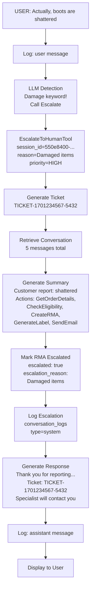

---

## Error Handling Paths

The system implements graceful error handling at multiple levels to prevent cascading failures and provide meaningful feedback to users.

### Exception Categorization

When an exception occurs during agent execution, the system categorizes it to determine the most appropriate user-facing response:

- **Timeout Errors**: Service (Ollama) is overloaded; hint to user that specialist will help
- **Database Errors**: System cannot access data; suggest specialist assistance
- **Model/Ollama Errors**: LLM is unavailable or crashed; fall back to escalation
- **Generic Errors**: Unknown error; always escalate to specialist for investigation

All errors are logged to conversation_logs with error metadata for debugging. The user receives a user-friendly message (never raw error text) and is offered escalation to a human specialist.

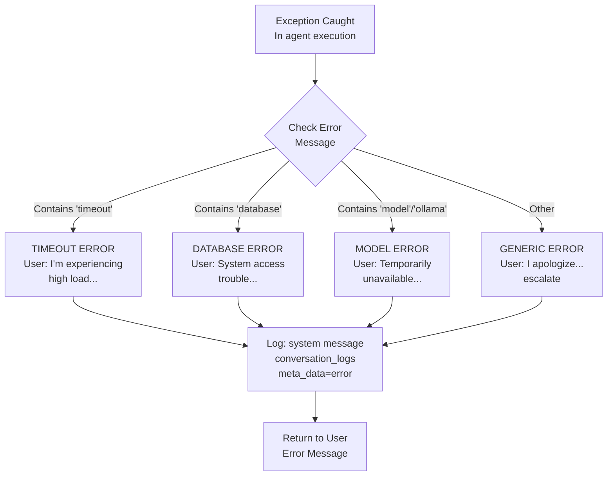

### Tool-Level Error Handling

Each tool is designed to fail gracefully without crashing the agent:

- **Try-Catch Pattern**: Each tool's `_run()` method wraps logic in try-except
- **Logging**: Exceptions logged with context (tool name, inputs, error details)
- **Structured Response**: Tools return ErrorOutput with success=false rather than raising exceptions
- **Agent Continuity**: Agent can read error output and decide to retry, use different tool, or escalate
- **User-Friendly Messages**: Tool error messages avoid technical jargon; never expose stack traces to user

This approach allows the agent to handle partial failures (e.g., database timeout on one lookup) without stopping the entire workflow.

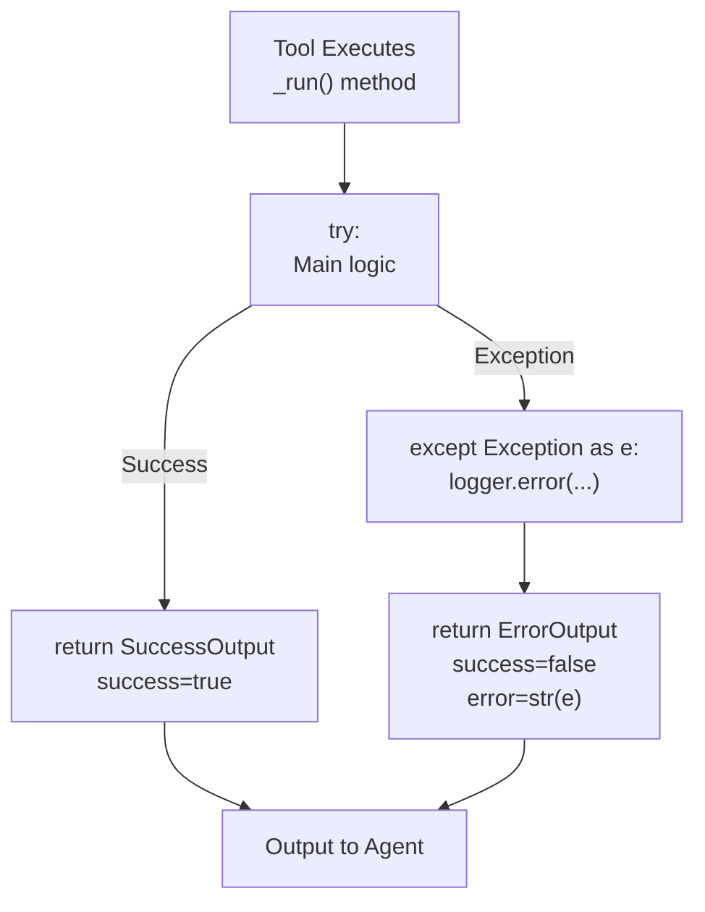

### Database Error Handling

Database operations use context managers to ensure ACID compliance and prevent data corruption:

- **Context Manager**: `with get_db_session()` ensures proper resource cleanup
- **Automatic Commit**: On success, changes committed to database
- **Automatic Rollback**: On any exception, all pending changes rolled back (no partial updates)
- **Guaranteed Close**: `finally` block closes session even if error occurs
- **Connection Safety**: Prevents connection leaks that could exhaust database pool

This approach ensures database integrity: either all changes in a tool execution succeed, or none of them do (atomic transactions).

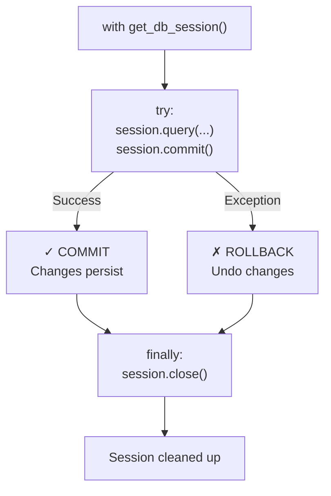

---

## Payload Specifications

All tools use Pydantic schemas for input validation and output serialization. This ensures:

- **Type Safety**: Python type hints prevent passing wrong data types
- **Required Fields**: Missing required inputs caught at validation time
- **Serialization**: Tool outputs automatically converted to JSON for LLM context
- **Documentation**: Schema definitions serve as inline API documentation
- **Validation**: Input schemas validate constraints (e.g., XOR for GetOrderDetails)

### Input/Output Schemas

#### GetOrderDetailsTool

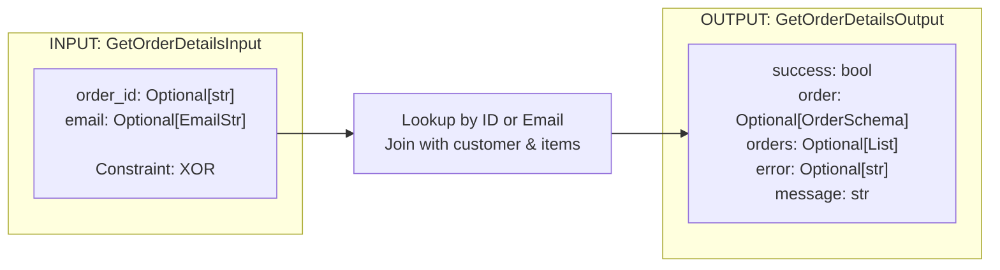

#### CheckEligibilityTool

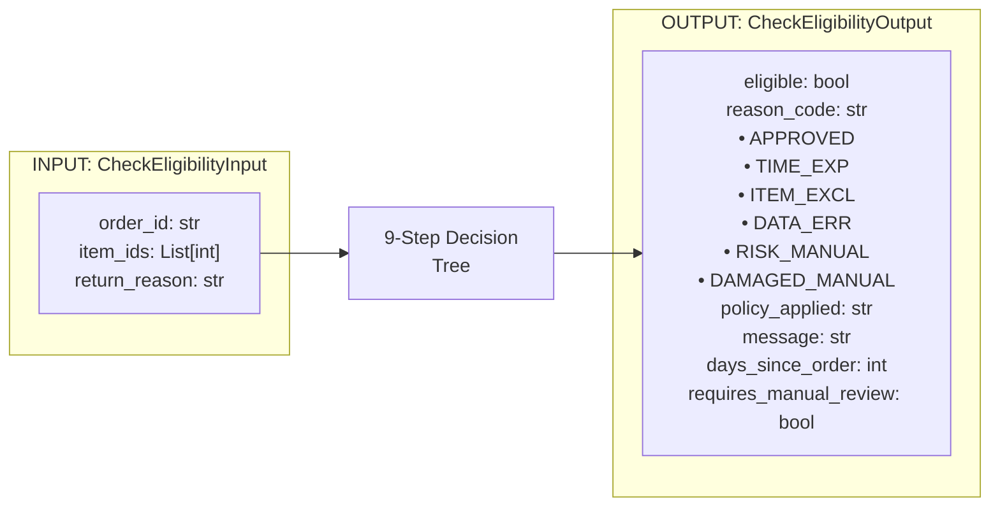

#### CreateRMATool

```mermaid
graph LR
    subgraph In["INPUT: CreateRMAInput"]
        In1["order_id: str<br/>customer_id: int<br/>item_ids: List[int]<br/>return_reason: str<br/>reason_code: str"]
    end

    subgraph Out["OUTPUT: CreateRMAOutput"]
        Out1["success: bool<br/>rma_number: str<br/>rma_id: int<br/>message: str"]
    end

    In1 --> Process["Generate RMA#<br/>Calc Refund<br/>INSERT rmas<br/>UPDATE orders"]
    Process --> Out1
```

#### GenerateReturnLabelTool

```mermaid
graph LR
    subgraph In["INPUT: GenerateReturnLabelInput"]
        In1["order_id: str<br/>rma_number: str"]
    end

    subgraph Out["OUTPUT: GenerateReturnLabelOutput"]
        Out1["success: bool<br/>label_url: str<br/>tracking_number: str<br/>message: str"]
    end

    In1 --> Process["Generate Tracking<br/>Generate Label URL<br/>UPDATE rmas"]
    Process --> Out1
```

#### SendEmailTool

```mermaid
graph LR
    subgraph In["INPUT: SendEmailInput"]
        In1["customer_email: EmailStr<br/>template_name: str<br/>• return_approved<br/>• return_rejected<br/>• label_ready<br/>context: dict"]
    end

    subgraph Out["OUTPUT: SendEmailOutput"]
        Out1["success: bool<br/>message_id: str<br/>preview: str<br/>message: str"]
    end

    In1 --> Process["Render Template<br/>Generate message_id<br/>Log to DB"]
    Process --> Out1
```

#### EscalateToHumanTool

```mermaid
graph LR
    subgraph In["INPUT: EscalateToHumanInput"]
        In1["session_id: str<br/>reason: str<br/>priority: str<br/>• LOW<br/>• MEDIUM<br/>• HIGH<br/>• URGENT"]
    end

    subgraph Out["OUTPUT: EscalateToHumanOutput"]
        Out1["success: bool<br/>ticket_id: str<br/>summary: str<br/>message: str"]
    end

    In1 --> Process["Generate Ticket<br/>Retrieve Conversation<br/>Build Summary<br/>Mark RMA Escalated"]
    Process --> Out1
```

#### ConversationLog Record

```mermaid
graph LR
    subgraph Schema["ConversationLog Schema"]
        Fields["id: int<br/>session_id: str<br/>customer_id: Optional[int]<br/>message_type: str<br/>• user<br/>• assistant<br/>• tool<br/>• system<br/>content: str<br/>meta_data: Optional[str JSON]<br/>created_at: datetime"]
    end

    subgraph Example1["Example: User Message"]
        Ex1["message_type: user<br/>content: I want to return..."]
    end

    subgraph Example2["Example: Tool Result"]
        Ex2["message_type: tool<br/>meta_data: {rma_number, error}"]
    end

    subgraph Example3["Example: Error"]
        Ex3["message_type: system<br/>meta_data: {error: str}"]
    end
```

---

## Key Design Principles

1. **Deterministic Business Logic** - All eligibility rules in code, not LLM
2. **Persistent Audit Trail** - Every message/action logged to database
3. **RAG-Powered Context** - Knowledge base for policies and templates
4. **Tool Composition** - Sequential tool calling for complex workflows
5. **Graceful Escalation** - Automatic escalation for damage, fraud, exceptions
6. **Type Safety** - Pydantic schemas for all payloads
7. **Error Recovery** - Categorized exceptions with fallback responses

---

## Data Transformation Summary

| Component | Transformation | Input | Output |
|-----------|----------------|-------|--------|
| **GetOrderDetails** | Database lookup | order_id/email | OrderSchema |
| **CheckEligibility** | 9-step decision tree | order_id, items, reason | EligibilityCode |
| **CreateRMA** | RMA generation & DB write | order_id, items | RMA#, refund amount |
| **GenerateLabel** | Label & tracking generation | RMA# | Label URL, tracking |
| **SendEmail** | Template rendering | email, template, context | Message ID |
| **EscalateToHuman** | Ticket creation & summary | session_id, reason | Ticket ID, summary |
| **Logging** | Message persistence | message payload | ConversationLog row |
